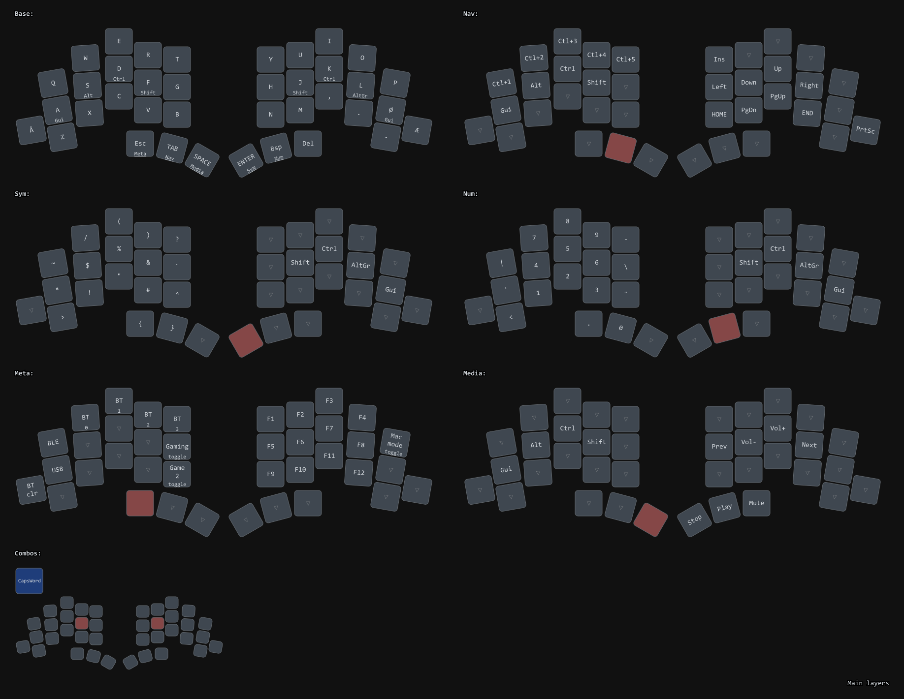

# TOTEM Dongle ZMK Config

Personal ZMK config for a TOTEM split keyboard with a 3-device setup: left half, right half, and a Prospector-based dongle. Built for Seeeduino XIAO BLE controllers, with Norwegian key definitions, Mac-mode overlays, Bluetooth host switching, gaming layers, and dongle-specific display and battery behavior.

Hardware build details, PCB files, and assembly instructions live in the upstream TOTEM and Prospector projects. This README focuses on the firmware configuration in this repo.

## Built On

- [TOTEM](https://github.com/GEIGEIGEIST/TOTEM)
- [ZMK](https://github.com/zmkfirmware/zmk)
- [Prospector](https://github.com/carrefinho/prospector)
- [prospector-zmk-module](https://github.com/carrefinho/prospector-zmk-module): ZMK module used for Prospector integration
- [keymap-drawer](https://github.com/caksoylar/keymap-drawer): layout rendering tool used by `scripts/render_layouts.py`
- [miryoku](https://github.com/manna-harbour/miryoku) as layout inspiration

Pinned revisions:

- [`zmkfirmware/zmk`](https://github.com/zmkfirmware/zmk): `641514a97db345f499dd50b0360e594270f008fe`
- [`carrefinho/prospector-zmk-module`](https://github.com/carrefinho/prospector-zmk-module): `ed98221f3b52b7066dbb10ba3af8a29150b93a5a` (`feat/new-status-screens`)

These commits, along with the pinned ZMK build workflow, are recorded in
[`config/west.yml`](config/west.yml) and [`.github/workflows/build.yml`](.github/workflows/build.yml).
Builds will not silently change when upstream branches move.

## Key Features

- Norwegian-localized keymap in [`config/totem.keymap`](config/totem.keymap) via [`config/keys_nb.h`](config/keys_nb.h)
- Main layers: `Base`, `Nav`, `Num`, `Sym`, `Meta`, `Media`
- Home row mods on the base and Mac overlay layers
- Mac mode through conditional layers
- Bluetooth slot switching, Bluetooth clear, and output select on `Meta`
- Two gaming layers
- Dongle tweaks: fixed brightness, 180-degree display rotation, split battery proxying
- Global radio/BLE tuning in [`config/totem.conf`](config/totem.conf)

## Layout Reference
Rendered layout references live in [`docs/layouts`](docs/layouts). They are generated from [`config/totem.keymap`](config/totem.keymap) by [`scripts/render_layouts.py`](scripts/render_layouts.py), which uses [keymap-drawer](https://github.com/caksoylar/keymap-drawer) to parse the keymap, normalize this repo's Norwegian and custom legends, and write the SVG/PNG outputs. The helper script is maintained in-repo.

Main layers:
- [`docs/layouts/totem-layouts-main.png`](docs/layouts/totem-layouts-main.png)
- [`docs/layouts/totem-layouts-main.svg`](docs/layouts/totem-layouts-main.svg)

Full layout:
- [`docs/layouts/totem-layouts.png`](docs/layouts/totem-layouts.png)
- [`docs/layouts/totem-layouts.svg`](docs/layouts/totem-layouts.svg)
- [`docs/layouts/totem-layouts.yaml`](docs/layouts/totem-layouts.yaml)



To regenerate:

```sh
python3 -m pip install --target .tools keymap-drawer PyYAML
python3 scripts/render_layouts.py
```

PNG output requires `rsvg-convert` in `PATH`.

## Build Targets

- `totem_left`: left keyboard half
- `totem_right`: right keyboard half
- `totem_dongle prospector_adapter`: Prospector dongle target
- `settings_reset`: reset target for clearing saved ZMK settings

Targets are defined in [`build.yaml`](build.yaml) and built in GitHub Actions via
[`.github/workflows/build.yml`](.github/workflows/build.yml).

## Flashing

Flash the left, right, and dongle images from the same artifact whenever the
dependency, board, or split configuration changes. Keymap-only changes require
flashing only the dongle.

For initial setup or to correct battery ordering:

1. Flash `settings_reset` to the dongle, then flash the three normal images.
2. Power on the left half before the right half so dongle slot 0/1 map to the
   left/right battery arcs.
3. Re-pair the dongle with the computer.
